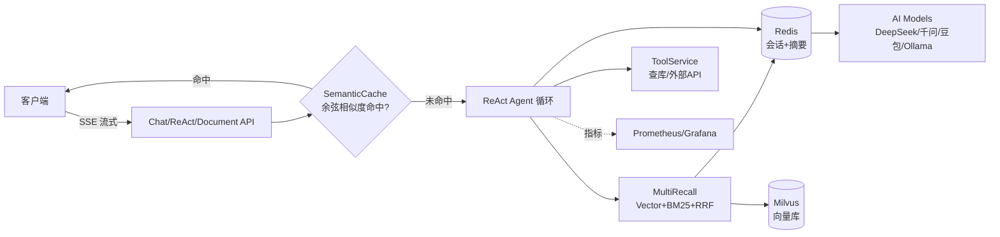

# AI Agent Platform

基于 Spring Boot 3 + LangChain4j 构建的企业级 AI Agent 平台，集成 ReAct 推理循环、多路召回 RAG、语义缓存和工具调用框架。

[](https://github.com/888newstep/ai-agent-platform/actions/workflows/ci.yml)
[](https://adoptium.net/)
[](https://spring.io/projects/spring-boot)
[](LICENSE)

An enterprise-grade **AI Agent Platform** built on **Spring Boot 3 + LangChain4j**, featuring a ReAct reasoning loop, adaptive multi-recall RAG (vector + BM25 + RRF fusion), semantic caching to cut LLM API costs, and a pluggable tool-calling framework — production-grade observability (Prometheus/Grafana) and reproducible RAG evaluation included.

## 为什么选择 AI Agent Platform？

与 Spring AI、低代码平台、普通 CRUD Demo 相比，这个项目的独特组合是 **面试导向 + 企业级可观测 + 语义缓存降本**：

| 对比对象 | 差异化优势 |
|---------|-----------|
| Spring AI / Spring AI Alibaba | 自研 ReAct 推理循环、Adaptive RAG、多路召回 RRF 融合、会话摘要压缩；源码即可当作面试题解 |
| Dify / 扣子等低代码平台 | 面向开发者而非业务人员：可扩展的工具注册表、可观测（Prometheus/Grafana）、可复现 RAG 评测 |
| 普通 CRUD / Demo 项目 | 语义缓存降低 API 成本、JMeter 压测、质量基线度量，是一套可量化的工程实践 |

> **🎯 适用人群**
> - 正在准备大厂 Java / AI 岗位面试的求职者（覆盖高频面试考点）
> - 需要快速搭建 AI 客服系统的中小企业或独立开发者
> - 想学习 RAG + Agent 完整落地实践的技术爱好者
> - 需要可扩展 AI Agent 框架的产品开发者

---

## 架构总览

> 完整架构设计请参阅 [docs/ARCHITECTURE.md](docs/ARCHITECTURE.md)

```
┌─────────────────────────────────────────────────────────────────┐
│                          AI Agent Platform                      │
│  ┌──────────────┐ ┌───────────────────┐ ┌─────────────────────┐ │
│  │   Chat API   │ │    ReAct API      │ │   Document API      │ │
│  └──────┬───────┘ └─────────┬─────────┘ └──────────┬──────────┘ │
│  ┌──────┴───────┐ ┌─────────┴─────────┐ ┌──────────┴──────────┐ │
│  │ AiAgentSrv    │ │   ReActAgent      │ │   DocumentService   │ │
│  └──────┬───────┘ └─────────┬─────────┘ └──────────┬──────────┘ │
│  ┌──────┴──────────────────────────────────────────┴──────────┐ │
│  │               SemanticCacheService (余弦相似度缓存)         │ │
│  └──────┬──────────────────────────────────────────┬──────────┘ │
│  ┌──────┴──────┐ MultiRecallService  ┌─────────────┴──────────┐ │
│  │ Vector(ML)  │  + BM25  + RRF 融合  │  Adaptive RAG Router  │ │
│  └──────┬──────┘                     └─────────────┬──────────┘ │
│  ┌──────┴──────────────────────┐  ┌───────────────┴──────────┐  │
│  │ ToolService(注册表自动发现)  │  │ LongContextManager(摘要)  │  │
│  └──────┬──────────────────────┘  └───────────────┬──────────┘  │
│  ┌──────┴─────┐ ┌────────┐ ┌────────┐ ┌───────────┴────────┐    │
│  │   MySQL    │ │ Redis  │ │ Milvus │ │  AI Models(策略切换)│    │
│  └────────────┘ └────────┘ └────────┘ └────────────────────┘    │
└─────────────────────────────────────────────────────────────────┘
```

**核心链路**：请求进入 → 语义缓存命中直接返回（降本）→ 未命中走 ReAct / Adaptive RAG（向量 + BM25 + RRF，工具调用）→ 长会话由 LongContextManager 滑动窗口 + 摘要压缩 → 结果回写缓存并流式（SSE）返回。

### 架构图（Mermaid）



---

## 功能特性

- **ReAct Agent 循环** — Thought → Action → Observation → Final Answer 推理循环，含死循环防护和超时控制
- **Adaptive RAG** — Query Router、查询改写、自适应多轮检索与 Self-RAG 结果验证
- **多路召回 RAG** — 向量检索（Milvus）+ BM25 关键词检索 + RRF 融合排序
- **语义缓存** — 基于 embedding 余弦相似度，自动缓存相似问题回答，降低 API 成本
- **API 保护** — Redis 分布式固定窗口限流 + 估算 Token 预算，按认证主体/IP 隔离高成本请求
- **多模型支持** — 策略模式动态切换（DeepSeek / 通义千问 / 豆包 / Qwen3-Flash / Ollama 本地）
- **工具调用框架** — 数据库查询、外部 API 调用，注册表模式自动发现
- **流式输出** — SSE 实时推送，5 分钟超时保护
- **会话管理** — Redis 存储会话上下文，24 小时 TTL 自动过期
- **Docker 一键部署** — 核心 4 个服务编排（MySQL + Redis + Milvus + App），Prometheus/Grafana 可选

---

## 技术栈

| 层级 | 技术 |
|------|------|
| 框架 | Spring Boot 3.5, LangChain4j 0.34 |
| 语言 | Java 17 |
| 数据库 | MySQL 8.0, Redis 7, Milvus 2.4 |
| AI 模型 | DeepSeek, 通义千问, 豆包, Qwen3-Flash, Ollama |
| 嵌入模型 | BGE-M3 (SiliconFlow API) |
| 部署 | Docker, Docker Compose |
| 压测与观测 | JMeter 5.6, Prometheus, Grafana |
| CI/CD | GitHub Actions |

---

## 快速开始

### 前置条件

- JDK 17+
- Docker & Docker Compose (推荐)
- Maven 3.9+

### 1. 克隆项目

```bash
git clone https://github.com/888newstep/ai-agent-platform.git
cd ai-agent-platform
```

### 2. 配置环境变量

```bash
cp .env.example .env
# 编辑 .env 填入你的 API 密钥
```

### 当前混合部署拓扑

本项目支持本地应用 + 云端向量库的开发方式：本地 Win11 运行 MySQL `localhost:3306` 和 Redis `localhost:6379`，云服务器运行 Milvus `19530`；通过 `MILVUS_HOST`、`MILVUS_DATABASE_NAME` 和 `MILVUS_COLLECTION_NAME` 指定目标。复用已有云端 collection 做评测时，建议设置 `MILVUS_READ_ONLY=true`，避免启动或导入流程修改线上数据。RabbitMQ 当前未进入 `newagent` 的代码依赖和运行链路，端口可达不代表项目已经接入该组件。

启动应用或运行评测前，可先执行混合部署预检：

```powershell
$env:MILVUS_HOST = "your-cloud-milvus-host"
$env:RABBITMQ_HOST = "your-cloud-rabbitmq-host"
.\scripts\check-infrastructure.ps1
```

脚本默认检查本机 `MYSQL_HOST/MYSQL_PORT`、`REDIS_HOST/REDIS_PORT` 和 Milvus `MILVUS_*` 配置；RabbitMQ 仅在设置 `RABBITMQ_HOST` 或传入 `-RabbitHost` 时检查。脚本不读取 `.env` 文件、不输出密码、不查询或修改 collection 数据，只验证 TCP 可达性以及 Milvus database/collection 名称是否配置。

### 3. 启动方式

混合部署时，应用可以在本机 IDE 或 Maven 中启动；确保启动配置中已经注入 `.env` 中的环境变量，并将 `MILVUS_HOST` 指向云端地址。复用已有云端 collection 做只读评测时，再设置 `MILVUS_READ_ONLY=true`。不要同时依赖 Docker Compose 启动的本地 Milvus。

如果希望使用全本地依赖，再使用下面的 Docker Compose 方式：

```bash
docker compose up -d
```

该命令会启动本地 MySQL、Redis、Milvus 和应用容器，属于独立的全本地拓扑；它不会验证或使用云端 Milvus/RabbitMQ。

### 4. 验证

```bash
curl http://localhost:8081/api/v1/agent/health
# 返回: {"status":"UP","service":"AI Customer Service Agent","version":"1.0.0"}
```

---

## API 使用示例

### 创建会话

```bash
curl -X POST http://localhost:8081/api/v1/agent/session
```

### 普通聊天

```bash
curl -X POST "http://localhost:8081/api/v1/agent/chat?sessionId={sessionId}&question=你好&useRag=true"
```

### ReAct 模式聊天（推理 + 工具调用）

```bash
curl -X POST "http://localhost:8081/api/v1/agent/react/chat?sessionId={sessionId}&question=查询数据库中的用户数量&useRag=true"
```

### 流式聊天

```bash
curl -N "http://localhost:8081/api/v1/agent/chat/stream?sessionId={sessionId}&question=请详细介绍RAG技术"
```

### 上传文档

```bash
curl -X POST -F "file=@文档.pdf" http://localhost:8081/api/v1/agent/document/upload
```

### 缓存管理

[`DELETE /api/v1/agent/cache`](src/main/java/com/aiagent/agent/api/AiAgentController.java:161) 清除全部语义缓存。

### 文档搜索

[`POST /api/v1/agent/document/search`](src/main/java/com/aiagent/agent/api/AiAgentController.java:148) 按向量检索上传的文档切片，支持自定义 topK 和阈值参数。

### 评测报告历史

评测接口需要管理员凭证。导出报告后，可以列出最近报告并比较两次评测的指标变化：

```bash
curl -H "X-Admin-Api-Key: ${ADMIN_API_KEY}" \
  "http://localhost:8081/api/v1/agent/evaluate/history?limit=20"

curl -H "X-Admin-Api-Key: ${ADMIN_API_KEY}" \
  "http://localhost:8081/api/v1/agent/evaluate/history/compare?baseline={fileName}&candidate={fileName}"
```

比较结果中的 `metricDeltas` 使用 `candidate - baseline`，并在数据集来源、样本数或 `topKs` 不一致时标记为不可直接比较。

### 可复现 RAG 评测

仓库提供最小示例数据集 `examples/evaluation-datasets/rag-sample.json`，默认配置已指向该目录。详细的双配置真实评测流程见 `docs/RAG_BENCHMARK.md`，运行脚本为 `scripts/run-rag-evaluation.ps1`。数据集中的 `relevantDocIds` 必须对应目标 vector store 的 ID：通用文档模式使用 chunk ID，QA 模式使用 `qa_pair_id`；只有先确认这些 ID 已存在，召回率和准确率才具有业务意义。若复用已有 QA collection（包括当前云端的 `cs_agent.ai_agent_documents` 或 `ecommerce_qa`），必须设置 `AI_VECTOR_STORE_MODE=qa`、对应的 `MILVUS_COLLECTION_NAME` 和 `MILVUS_READ_ONLY=true`；这些 collection 不能使用默认的 LangChain4j 通用文档 schema。真实数据请通过 `AI_EVALUATION_DATASET_DIRECTORY` 指向本地私有目录，避免提交到 GitHub。

```bash
curl -X POST \
  -H "X-Admin-Api-Key: ${ADMIN_API_KEY}" \
  "http://localhost:8081/api/v1/agent/evaluate/export?datasetPath=examples/evaluation-datasets/rag-sample.json&topKs=1,3,5"
```
---

正式评测不要直接复用公开样例或由向量 Top-K 自动生成的 smoke 数据。先在本地私有目录完成结构校验，再将数据集类型标记为 `independent-human-labeled`：

```powershell
powershell -ExecutionPolicy Bypass -File scripts/validate-rag-dataset.ps1 `
  -DatasetPath 'C:\private\rag-datasets\customer-faq.json' `
  -DatasetKind independent-human-labeled `
  -MinCases 30 `
  -MinCategories 3 `
  -RequireCategory

powershell -ExecutionPolicy Bypass -File scripts/run-rag-evaluation.ps1 `
  -DatasetPath 'C:\private\rag-datasets\customer-faq.json' `
  -DatasetKind independent-human-labeled `
  -VectorStoreMode qa `
  -MilvusCollection ecommerce_qa `
  -MilvusReadOnly true
```

`validate-rag-dataset.ps1` 只检查文件结构、重复问题、类别和 `relevantDocIds` 是否非空，不会验证 ID 是否存在于 Milvus，也不能替代人工复核。`datasetKind` 会写入本地评测汇总报告，避免把 sample/smoke 结果误当成正式业务基准。

### Adaptive RAG 批量回放

使用公开样例或本地私有 query 文件批量调用 `/api/v1/agent/rag/debug`，输出 routeType、verificationLevel、endReason、检索轮次和客户端延迟分布，并标记 `evidenceStatus` 与 `benchmarkReady`。当 `benchmarkReady=false` 或证据状态为 `empty` 时，只能用于诊断数据链路，不能当作有效 RAG 基线。脚本默认不保存原始问题和答案上下文；需要本地诊断时再显式传入 `-IncludeQuestions`。报告写入 `evaluation-reports/`，不会提交到 GitHub。

```powershell
powershell -ExecutionPolicy Bypass -File scripts/replay-adaptive-rag.ps1 `
  -AdminApiKey $env:ADMIN_API_KEY
```

输入文件可以是现有评测 JSON 数组，也可以是包含 `queries` 数组的 JSON 对象；每项至少包含 `question` 字段，可选 `category` 字段。该回放脚本用于分析 Agent 决策链，不等价于带 `relevantDocIds` 的检索质量评测。

### JMeter 并发压测

仓库提供参数化的 JMeter 非 GUI 测试计划，详细边界、参数和结果解释见 [`docs/JMETER_LOAD_TEST.md`](docs/JMETER_LOAD_TEST.md)。默认只压测公开健康接口；只读文档搜索场景会真实访问 Embedding/Milvus，但不会上传或修改文档。

```powershell
.\scripts\run-jmeter-smoke.ps1 `
  -Scenario health `
  -Threads 5 `
  -RampUpSeconds 5 `
  -DurationSeconds 30 `
  -FailOnErrors
```

当前混合拓扑中，JMeter 在本地 Win11 运行并访问本地应用；应用再连接本地 MySQL/Redis 和云端 Milvus。RabbitMQ 当前仅做可选连通性预检，不能把其端口可达写成项目已接入。
## 架构设计

```
┌─────────────────────────────────────────────────────────────┐
│                    AI Agent Platform                         │
├─────────────────────────────────────────────────────────────┤
│  Controller Layer                                           │
│  ┌─────────────┐ ┌──────────────┐ ┌──────────────────┐     │
│  │ Chat API     │ │ ReAct API    │ │ Document API     │     │
│  └──────┬───────┘ └──────┬───────┘ └────────┬─────────┘     │
├─────────┼────────────────┼──────────────────┼───────────────┤
│  Service Layer           │                  │               │
│  ┌──────┴────────┐ ┌─────┴──────┐ ┌────────┴──────────┐    │
│  │ AiAgentService│ │ ReActAgent  │ │ DocumentService   │    │
│  └──────┬────────┘ └─────┬──────┘ └────────┬──────────┘    │
│         │                │                  │               │
│  ┌──────┴────────────────┴──────────────────┴──────────┐    │
│  │              SemanticCacheService                    │    │
│  └──────────────────────┬──────────────────────────────┘    │
├─────────────────────────┼──────────────────────────────────┤
│  Retrieval Layer        │                                   │
│  ┌──────────────────────┴──────────────────────────────┐    │
│  │              MultiRecallService                     │    │
│  │  ┌────────────────┐  ┌──────────────────────────┐   │    │
│  │  │ Vector Search  │  │  BM25 Keyword Search     │   │    │
│  │  │ (Milvus)       │  │  (Bm25Search)            │   │    │
│  │  └────────┬───────┘  └──────────┬───────────────┘   │    │
│  │           └──────────┬──────────┘                    │    │
│  │                  RRF Fusion                          │    │
│  └──────────────────────────────────────────────────────┘    │
├──────────────────────────────────────────────────────────────┤
│  Tool Layer                                                   │
│  ┌──────────────────────────────────────────────────────┐    │
│  │  ToolService (query_database / call_external_api)    │    │
│  └──────────────────────────────────────────────────────┘    │
├──────────────────────────────────────────────────────────────┤
│  Infrastructure Layer                                        │
│  ┌──────────┐ ┌──────────┐ ┌──────────┐ ┌──────────────┐    │
│  │  MySQL   │ │  Redis   │ │  Milvus  │ │  AI Models   │    │
│  └──────────┘ └──────────┘ └──────────┘ └──────────────┘    │
└──────────────────────────────────────────────────────────────┘
```

> 详细架构设计请参阅 [docs/ARCHITECTURE.md](docs/ARCHITECTURE.md)

---

## ReAct Agent 详解

### 核心循环

```
Thought: 分析问题，决定下一步行动
    ↓
Action: 选择工具（query_database / call_external_api）
    ↓
Action Input: 工具参数
    ↓
Observation: 工具执行结果
    ↓
（重复以上步骤，直到得到足够信息）
    ↓
Final Answer: 给出最终回答
```

### 安全机制

| 机制 | 说明 |
|------|------|
| 最大迭代步数 | 默认 10 步，防止无限循环 |
| 超时控制 | 整体任务 3 分钟超时 |
| 死循环检测 | 相同 Observation 连续出现 3 次则终止 |
| 异常捕获 | LLM 调用或工具执行失败时优雅降级 |

---

## 多路召回 RAG

### 召回流程

1. **向量检索** — Milvus 语义相似度检索，捕获语义相近的文档
2. **BM25 关键词检索** — 关键词精确匹配，捕获包含特定术语的文档
3. **RRF 融合** — 倒数排名融合算法，合并两路结果

### RRF 公式

```
score(d) = Σ 1/(k + rank_i(d))
```

其中 `k=60`，`rank_i(d)` 是文档 d 在第 i 路检索中的排名。

---

## 项目结构

```
src/main/java/com/aiagent/
├── agent/
│   ├── api/                         # Agent REST API
│   ├── application/                 # 普通聊天、ReAct、Multi-Agent 编排
│   └── infrastructure/tool/         # 数据库与外部 API 工具
├── infrastructure/
│   ├── cache/                       # 语义缓存与 RAG 缓存
│   ├── config/                      # 模型、Milvus、安全与限流配置
│   └── metrics/                     # Micrometer 业务指标
├── knowledge/
│   ├── application/                 # 文档上传、解析与入库
│   └── infrastructure/              # Parser、Splitter、VectorStore
├── rag/application/                 # Adaptive RAG、Multi-Recall、评测
├── chat/                            # 会话与 SSE 流式响应
└── shared/                          # 公共响应体与异常处理
```
---

## 配置说明

> 安全提示：启动前必须通过环境变量设置 `JWT_SECRET` 和 `ADMIN_API_KEY`。仓库中的 `.env.example` 仅是占位模板，不要直接用于生产环境。

### 模型切换

在 `application.yml` 中修改 `ai.model.provider`：

```yaml
ai:
  model:
    provider: deepseek   # 可选: deepseek, qianwen, doubao, qwen3-flash, local
```

### 嵌入模型切换

```yaml
ai:
  embedding:
    provider: siliconflow  # 可选: local, local-qwen3, siliconflow
```

### 环境变量

参考 `.env.example` 文件，所有敏感配置通过环境变量注入。

---

## 面试价值

该项目适用于以下面试场景：

### Java 后端岗

| 知识点 | 项目体现 |
|--------|---------|
| Spring Boot 启动流程 | AiModelConfig 自动配置、@ConditionalOnProperty |
| 策略模式 | 多模型动态切换 |
| Redis 缓存 | 会话管理、语义缓存 |
| 数据库优化 | JPA + 连接池配置 |
| Docker 部署 | 4 服务编排、健康检查 |

### AI 应用岗

| 知识点 | 项目体现 |
|--------|---------|
| ReAct Agent | 完整推理循环、死循环防护、超时控制 |
| 长上下文管理 (Q174) | 滑动窗口 + 摘要压缩 + 历史检索 |
| RAG 效果评估 (Q173) | 召回率/准确率/F1/延迟量化评估 |
| RAG 优化 | 多路召回 + RRF 融合 |
| 成本控制 | 语义缓存、本地模型降级 |
| Embedding | SiliconFlow BGE-M3 接入 |
| 向量数据库 | Milvus 集合创建、索引构建 |
| 多智能体 (Q147) | Supervisor + Worker 协作模式 |
| SSE 流式输出 (Q151-153) | 心跳机制 + 虚拟线程管理 |

---

## Contributors

Thanks to the people who have contributed to this project:

<a href="https://github.com/codeAnqiang-ma">
  
</a>

> Want to contribute? See [CONTRIBUTING.md](CONTRIBUTING.md). All contributions are welcome!

---

## License

Apache License 2.0
